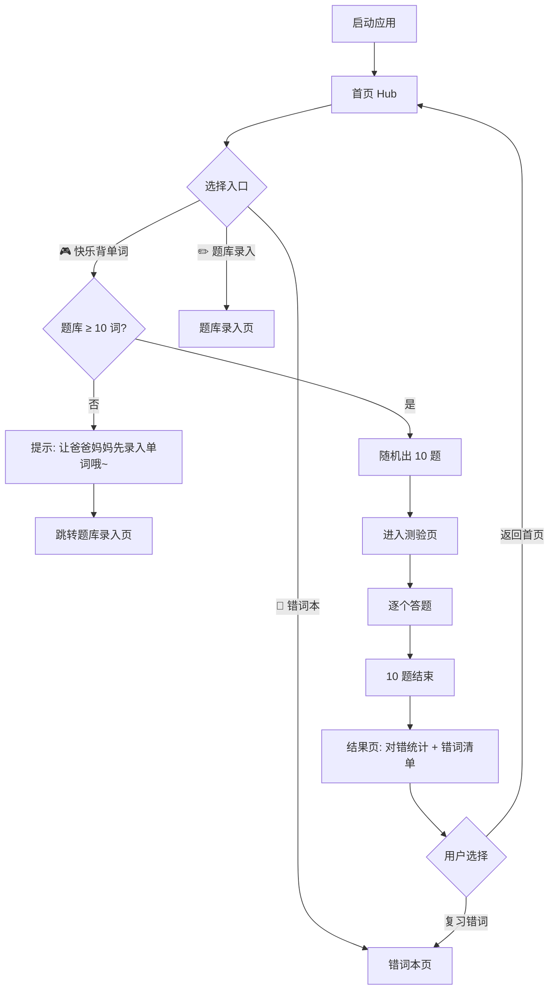
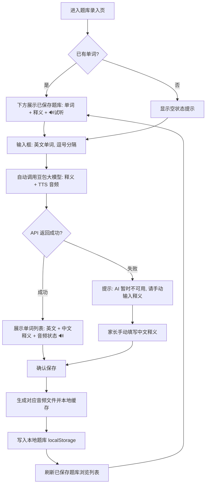
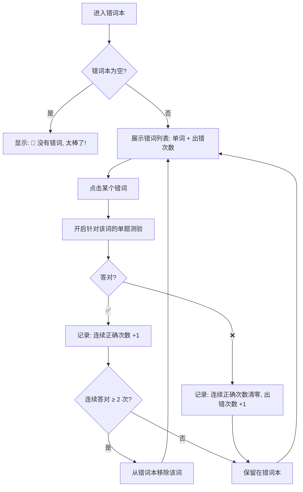

# 🐣「快乐背单词」产品需求文档

> **版本**：v2.0 | **日期**：2026-06-10 | **状态**：已确认（Shaping-PRD 六轮）  
> **作者**：digoo2008（张伟） | **产品分身**：hermes-product-pm

---

## 文档信息

| 字段 | 内容 |
|------|------|
| 文档版本 | v2.0 |
| 创建日期 | 2026-06-10 |
| 作者 | digoo2008（张伟） |
| 状态 | 已确认 |
| 前置文档 | [产品设计方案-v1.0.md](./产品设计方案-v1.0.md)（已废止，被本文档替代） |
| 原型文件 | [garden-theme-v3.html](./garden-theme-v3.html)（点击填空交互参考，需按新流程重构） |

---

## 1. 背景与问题

### 1.1 业务背景

小学低年级（6-9 岁）是英语启蒙的黄金窗口期，但"背单词"这件事对大多数家庭来说都是亲子冲突的高发地带。现有的背单词方式——手写抄词、家长听写——本质上延续了"死记硬背"的机械模式，对低龄儿童缺乏吸引力。

数字化背单词工具（百词斩、不背单词等）虽已成熟，但它们的 UI 和交互设计面向中学生和成人，低龄儿童（尤其是 8 岁以下）难以独立使用。市场上缺少一款**真正为低龄儿童设计**的桌面端背单词工具。

### 1.2 核心问题

> **低龄儿童背单词过程机械、痛苦、抗拒，家长不得不"逼着背"，导致学习效率低、亲子关系紧张。**

### 1.3 问题证据

- **一手观察**：作者家 8 岁孩子，当前"边写边背 + 大人陪听写"，全程抗拒、闹情绪，听写错误率极高
- **家长共识**：身边多位家长反馈类似困境——"背单词是每天最头疼的事"
- **行为信号**：孩子不是"学不会"，而是"不想学"——说明问题不在难度，在体验

---

## 2. 目标与成功指标

### 2.1 产品目标

1. 通过**花园童话风 UI + 游戏化交互**，让背单词像玩游戏一样有吸引力
2. 通过**点击填空模式**降低入门门槛——孩子可以借助选项联想到正确答案，减少挫败感
3. 通过**语音鼓励 + 善意纠错**（重试直到正确），替代家长的"逼迫感"
4. 通过**错词本 + 复习机制**，让薄弱词得到针对性加强

### 2.2 成功指标

| 指标 | 当前值 | 目标值 | 衡量方式 |
|------|--------|--------|----------|
| 情绪指标 | 每次背单词都抗拒、闹情绪 | 孩子主动打开，不抵触 | 家长观察记录 |
| 持续使用 | 无 | 连续使用直到背完第一批 30 个自录单词 | 程序内打卡天数记录 |
| 词汇掌握 | 听写错误率高 | 错词本中单词能通过复习清零 | 错词本统计 |

### 2.3 失败定义

- 孩子使用 3 次后仍然抗拒打开 → 交互体验未达标
- 家长反馈"跟之前听写没区别，就是换了个屏幕" → 产品与替代方案无差异化

---

## 3. 目标用户

### 3.1 核心用户画像

**用户 A：低龄儿童学习者（8 岁，二/三年级）**

| 维度 | 描述 |
|------|------|
| 谁 | 小学低年级学生，有英语启蒙需求，识字量有限 |
| 当前怎么做 | 手写抄词本 + 家长陪着听写，全程被动接受 |
| 痛点 | 觉得背单词"无聊""痛苦"；听写时情绪崩溃、抗拒；错了被指出后有挫败感 |
| 期望 | 像玩游戏一样背单词；答错不会被指责，而是被鼓励；能自己独立完成，不需要大人一直陪着 |

**用户 B：陪伴型家长**

| 维度 | 描述 |
|------|------|
| 谁 | 孩子家长，愿意花时间帮孩子学习，但"逼着背"很折磨双方 |
| 当前怎么做 | 每晚陪着听写，纠正错误，安抚情绪 |
| 痛点 | 陪听写消耗时间精力；孩子闹情绪时自己也烦躁；不确定孩子到底掌握了多少 |
| 期望 | 提前录好单词，孩子自己就能背；能看到错词统计，知道哪些词需要加强；不用每次都当"坏人" |

### 3.2 用户故事地图

#### Epic 1：家长录入单词，孩子开始背

**概述**：家长在录入页输入英文单词，AI 自动释义，保存为题库。孩子从首页进入测验。

| 编号 | 层级 | 故事描述 | 优先级 | INVEST 验证 |
|------|------|----------|--------|-------------|
| US-1.1 | Story | 作为**家长**，我想要输入英文单词后系统**自动给出中文释义 + 生成音频**，保存后在页面下方看到**已保存题库浏览列表**（单词/释义/试听/删除），以便随时查看有哪些词 | P0 | I✓ N✓ V✓ E✓ S✓ T✓ |
| US-1.1.1 | Sub-story | 输入"apple, banana, red, blue" → 自动调用豆包大模型 → 返回释义 + 生成 TTS 音频 → 确认保存 → 下方刷新题库列表 | P0 | — |
| US-1.1.2 | Sub-story | 空题库时点击"快乐背单词" → 弹出提示"让爸爸妈妈先帮你录入单词哦~" → 点击跳转录入页 | P0 | — |
| US-1.1.3 | Sub-story | 浏览已保存题库：看到所有单词（英文 + 中文释义 + 🔊试听按钮 + 🗑️删除按钮） | P0 | — |
| US-1.1.4 | Sub-story | 点击 🔊 试听按钮 → 播放对应单词的标准发音 | P0 | — |
| US-1.2 | Story | 作为**孩子**，我想要在首页看到三个入口（快乐背单词 / 错词本 / 题库录入），以便选择要做什么 | P0 | I✓ N✓ V✓ E✓ S✓ T✓ |
| US-1.3 | Story | 作为**孩子**，我想要点击"快乐背单词"后系统自动从题库随机出 10 题，以便开始背单词 | P0 | I✓ N✓ V✓ E✓ S✓ T✓ |
| US-1.3.1 | Sub-story | 题库不足 10 词时，系统提示"单词不够哦，让爸爸妈妈再录一些~" | P1 | — |

**INVEST 验证说明**：
- US-1.1: E✓ — 豆包 API 接入是技术前置依赖，已确认可行性
- US-1.3.1: 降为 P1 —— MVP 首次使用有默认词库（4 个），极端情况才触发。先做前端判断 + 提示文案，不阻塞 P0

---

#### Epic 2：孩子背单词过程中的完整交互

**概述**：点击填空模式——单词部分字母挖空、下方字母选项，孩子点击字母填入。答对撒花，答错可重试。

| 编号 | 层级 | 故事描述 | 优先级 | INVEST 验证 |
|------|------|----------|--------|-------------|
| US-2.1 | Story | 作为**孩子**，我想要看到单词部分字母被挖空，下方有字母选项按钮，以便点击填入 | P0 | I✓ N✓ V✓ E✓ S✓ T✓ |
| US-2.2 | Story | 作为**孩子**，我想要点击已填字母能撤回、或者点"清空"重新来，以便修正填错的内容 | P0 | I✓ N✓ V✓ E✓ S✓ T✓ |
| US-2.3 | Story | 作为**孩子**，当我填满所有空位并点"检查"后，如果**答对**，我想要看到撒花动画 + 得分弹出 + 自动进入下一题 | P0 | I✓ N✓ V✓ E✓ S✓ T✓ |
| US-2.4 | Story | 作为**孩子**，当我答错时，我想要听到语音"再试试~"，填空框抖动，然后可以重新填或点"跳过" | P0 | I✓ N✓ V✓ E✓ S✓ T✓ |
| US-2.4.1 | Sub-story | 答错后重填 → 再次检查 → 直到正确为止 → 计入正确统计（但标注"尝试了 N 次"） | P0 | — |
| US-2.4.2 | Sub-story | 点击"跳过" → 显示正确答案 → 该单词自动计入错词本 | P0 | — |
| US-2.4.3 | Sub-story | 连续答错 3 题 → 语音鼓励"没关系，再来一次！你已经很棒了！"或"快接近了，加油！" | P1 | — |
| US-2.5 | Story | 作为**孩子**，当我遇到不认识的单词时，我想要点"提示"按钮——系统朗读单词、右上角显示完整单词 3 秒、自动填入第一个空位 | P0 | I✓ N✓ V✓ E✓ S✓ T✓ |
| US-2.5.1 | Sub-story | 使用提示后，该题得分减半（满分 10 → 5） | P0 | — |
| US-2.6 | Story | 作为**孩子**，当我连续答对时，我想要看到"连对🔥"标识和额外的连对加分，以便获得成就感 | P1 | I✓ N✓ V✓ E✓ S✓ T✓ |

**INVEST 验证说明**：
- US-2.6: 降为 P1 —— 核心成就感来自"打完 10 个词"，连对的锦上添花可后续迭代

---

#### Epic 3：背完后的回顾与错词复习

**概述**：一轮 10 题结束后展示结果，错词自动收录进错词本。孩子或家长可从首页进入错词本复习。

| 编号 | 层级 | 故事描述 | 优先级 | INVEST 验证 |
|------|------|----------|--------|-------------|
| US-3.1 | Story | 作为**孩子**，一轮 10 题结束后，我想要看到本轮结果（✅ N/10 正确 + 错词清单），以便知道自己学得怎样 | P0 | I✓ N✓ V✓ E✓ S✓ T✓ |
| US-3.2 | Story | 作为**孩子/家长**，我想要进入错词本，看到所有错过 ≥1 次的单词及其出错次数，以便针对性复习 | P0 | I✓ N✓ V✓ E✓ S✓ T✓ |
| US-3.2.1 | Sub-story | 错词本中选择一个单词 → 开启针对该单词的填空测验 | P1 | — |
| US-3.2.2 | Sub-story | 错词本中单词通过复习后（连续 2 次答对）→ 从错词本中移除 | P1 | — |
| US-3.3 | Story | 作为**家长**，我想要看到孩子的历史记录（每次测验日期、正确率），以便追踪学习进展 | P2 | I✓ N✓ V✓ E✓ S✓ T✓ |

**INVEST 验证说明**：
- US-3.3: 降为 P2 —— MVP 阶段家长的观察反馈比历史数据更重要，后续迭代再做

---

## 4. 需求范围

### 4.1 MVP 范围（本次必须交付）

| # | 功能 | 对应故事 |
|---|------|----------|
| 1 | 首页 Hub：三个入口（快乐背单词 / 错词本 / 题库录入） | US-1.2 |
| 2 | 题库录入页：英文输入 → AI 自动释义（豆包大模型）→ 确认保存 | US-1.1 |
| 3 | 默认预置词库：apple, banana, red, blue（含中文释义） | US-1.1 |
| 4 | 空题库保护：无词时提示并跳转录入页 | US-1.1.2 |
| 5 | 测验页（点击填空）：挖空展示 + 字母选项 + 点击填入/撤回/清空 | US-2.1, US-2.2 |
| 6 | 答对流程：撒花 + 得分弹出 + 1.5 秒自动下一题 | US-2.3 |
| 7 | 答错流程：语音"再试试" + 填空框抖动 → 可重试或跳过 → 跳过记入错词本 | US-2.4 |
| 8 | 提示功能：语音朗读 + 右上角显示完整单词 3 秒 + 自动填入首空（得分减半） | US-2.5 |
| 9 | 结果页：本轮对/错统计 + 错词清单 | US-3.1 |
| 10 | 错词本：错词列表 + 出错次数 | US-3.2 |
| 11 | 数据持久化：localStorage（后继迁移 SQLite） | — |

### 4.2 明确不做（本次不纳入）

- ❌ **拖拽拼词模式**（留给复习阶段，v3.0）
- ❌ **年级分级词库**（已被"手动录入"替代）
- ❌ **每日背词数量自定义**（MVP 固定 10 题，迭代再做）
- ❌ **历史记录列表**（P2 功能）
- ❌ **打卡/连续天数**（P2 功能）
- ❌ **混合模式（填空+拖拽交替）**
- ❌ **自定义主题切换**（先锁定花园童话风）
- ❌ **Tauri 桌面打包（.exe）**（MVP 跑通 Tauri 开发环境即可）

### 4.3 后续迭代方向

- **v2.1**：拖拽拼词复习模式上线；错词本复习闭环（连续答对 2 次移除）
- **v2.2**：每日背词数量自定义；打卡天数记录；历史记录页
- **v3.0**：Windows 打包 .exe；SQLite 替换 localStorage

---

## 5. 核心业务流程图

### 5.1 整体应用流程



### 5.2 单题答题流程（核心交互）

```mermaid
flowchart TD
    A[展示题目: 挖空单词 + 中文释义 + 字母选项] --> B[孩子点击字母填入]
    B --> C{所有空位填满?}
    C -->|否| B
    C -->|是| D[启用"检查"按钮]
    
    D --> E{孩子点"检查"}
    E --> F{答案正确?}
    
    F -->|✅ 正确| G[撒花动画 + 得分弹出]
    G --> H[得分计算: 是否用过提示?]
    H -->|无提示| I[+10 分]
    H -->|有提示| J[+5 分]
    I --> K[1.5 秒后自动下一题]
    J --> K
    
    F -->|❌ 错误| L[填空框抖动 + 语音'再试试~']
    L --> M{孩子选择}
    M -->|重填| N[清空错误空位 → 回到 B]
    M -->|跳过| O[显示正确答案]
    O --> P[该单词记入错词本]
    P --> K
```

### 5.3 题库录入与浏览流程



### 5.4 错词复习流程



---

## 6. 功能详述

### 6.1 首页 Hub

**功能描述**：应用启动后展示首页，提供三个功能入口。

**操作流程**：
1. 首页展示花园童话风背景 + 应用标题"🐣 快乐背单词"
2. 三个卡片式入口按钮垂直排列
3. 底部显示快照信息：题库单词总数 / 今日已背 / 错词本待复习数

**关键交互规则**：
- "快乐背单词"点击前检查题库是否 ≥ 1 词（不足则弹窗提示 + 跳录入页）
- 题库 ≥ 1 但 < 10 时仍可进入测验（出全部词），不做拦截
- 错词本为空时，入口卡片显示灰色 + "暂无错词 👍"

**边界与异常**：

| 场景 | 触发条件 | 系统行为 |
|------|----------|----------|
| 空题库 | 题库为空 | 弹窗"Mmmm，单词不够哦，让爸爸妈妈先帮你录入单词吧~" + 点击跳转录入页 |
| 题库不足 10 词 | 1-9 词 | 正常进入，有多少出多少题 |
| 错词本为空 | 无错词 | 入口灰色，文字"暂无错词 👍" |

---

### 6.2 题库录入与浏览页

**功能描述**：家长输入英文单词 → AI 自动释义 + 生成音频 → 保存后展示已保存题库，支持浏览和试听。

**页面布局**（上下结构）：

```
┌─────────────────────────────────┐
│  ✏️ 题库录入                      │
│  ┌─────────────────────────────┐ │
│  │ 输入英文单词，逗号分隔       │ │  ← 输入区
│  │ [apple, banana, red, blue]  │ │
│  └─────────────────────────────┘ │
│  [AI 自动释义并生成音频]         │  ← 自动触发（输入后即时）
│                                  │
│  ─────── 已保存题库（N 个词）────── │
│  ┌──────┬──────┬────────┬──────┐ │
│  │ 单词  │ 释义  │ 音频    │ 操作 │ │  ← 浏览区
│  ├──────┼──────┼────────┼──────┤ │
│  │apple │ 苹果  │ 🔊  ▶  │ 🗑️  │ │
│  │banana│ 香蕉  │ 🔊  ▶  │ 🗑️  │ │
│  │red   │ 红色  │ ⏳生成中│ 🗑️  │ │
│  └──────┴──────┴────────┴──────┘ │
└─────────────────────────────────┘
```

**操作流程**：
1. 家长在文本区输入英文单词（逗号或换行分隔）
2. 系统**自动**调用豆包大模型：获取中文释义 + **生成 TTS 音频**
3. 展示确认列表：英文 + 中文释义 + 音频状态（✅已生成 / ⏳生成中 / ❌失败）
4. 家长确认/修改释义 → 点击"保存"
5. 音频文件本地缓存 → 单词 + 释义 + 音频路径存入 localStorage
6. **保存后页面下方自动刷新题库浏览列表**，家长可以：
   - 看到所有已保存单词（单词 + 释义 + 🔊试听按钮）
   - 点击 🔊 播放对应音频
   - 点击 🗑️ 删除某个单词

**关键交互规则**：
- **AI 调用时机**：输入英文后**自动触发**（无需手动点击按钮），用防抖（debounce 500ms）避免频繁调用
- **音频生成**：豆包大模型 TTS 或浏览器 Web Speech API 预生成 → 保存为本地音频文件（mp3/wav）→ 存储路径到题库数据
- **音频试听**：已保存题库列表中，每个单词旁有 🔊 按钮 → 点击播放对应音频
- **浏览区**：页面下方常驻展示所有已保存单词的表格，保存后自动刷新
- 重复单词自动去重（保留首次录入的中文释义和音频）
- 豆包 API 调用失败 → 降级为手动录入模式（英文 + 中文两个输入框，逐词添加）
- 保存成功后 toast 提示"N 个新单词已保存！（题库共 M 词）"

**AI 释义 Prompt 设计（豆包大模型）**：
```
你是一个儿童英语学习助手。请为以下英文单词给出适合6-9岁中国小朋友理解的中文释义。
要求：简短（1-3个汉字）、准确、不要用生僻字。

英文单词：[用户输入的单词列表，逗号分隔]
输出格式：JSON {"单词1": "释义1", "单词2": "释义2", ...}
```

**音频生成方案**：
- Phase 1（Web 原型阶段）：使用浏览器 Web Speech API 朗读 → 暂不本地缓存，每次实时朗读
- Phase 2（Tauri 阶段）：使用 edge-tts 生成 mp3 → 本地缓存 → 路径存入题库数据

**数据存储结构更新**：
```json
{
  "wordBank": {
    "apple": { "chinese": "苹果", "audio": "/cache/audio/apple.mp3" },
    "banana": { "chinese": "香蕉", "audio": "/cache/audio/banana.mp3" }
  }
}
```

**边界与异常**：

| 场景 | 触发条件 | 系统行为 |
|------|----------|----------|
| 输入为空 | 未输入任何英文 | placeholder 提示"请输入英文单词，用逗号分隔" |
| API 超时 | 豆包调用 > 5 秒 | 显示"AI 暂时不可用，请手动输入释义"，切换到手动模式 |
| 单词已存在 | 录入的单词与题库重复 | 跳过已有单词，提示"N 个单词已存在，X 个新单词已保存" |
| 音频生成失败 | TTS 服务不可用 | 单词仍可保存，音频列显示"❌暂不可用"，不影响测验（测验时用 Web Speech 实时朗读） |
| 删除单词 | 点击 🗑️ | 弹窗确认"确定删除 [单词] 吗？"→ 确认后从题库和错词本同步移除 |
| 题库为空 | 首次使用 | 浏览区显示"还没有单词哦，在上面输入第一个单词吧~" |
| 音频未缓存 | Tauri 迁移前（Web 阶段） | 浏览区按钮显示"🔊 实时朗读"，点击调用 Web Speech API |

---

### 6.3 测验页（点击填空）

**功能描述**：核心背单词页面，单词部分字母挖空，孩子点击下方字母选项填入。

**操作流程**：
1. 系统从题库随机抽取 10 题（或全部词，若 < 10）
2. 每题：显示中文释义 + 部分字母已展示 + 部分字母挖空（约 35% 字母挖空）
3. 孩子点击字母选项 → 字母填入当前高亮的空位 → 自动跳转下一个空位
4. 可点击已填字母撤回、或点"清空"全部撤回
5. 填满 → "检查"按钮激活 → 判断对错（详见 §5.2 流程图）

**关键交互规则**：
- **挖空数量**：`Math.min(Math.max(1, Math.ceil(len * 0.35)), 3, len - 1)` —— 至少 1 个、至多 3 个、不超过词长-1
- **字母选项数量**：`Math.max(6, 挖空数 + 2)` —— 至少 6 个干扰项
- **提示按钮**：可多次使用，但每次使用后该题得分自动减半（仅首次生效，后续不再减）
- **语音朗读**：每道题进入时自动朗读一次单词（Web Speech API → 后继 edge-tts）

**答错交互详情**：
| 步骤 | 系统行为 | 用户感知 |
|------|----------|----------|
| 1 | 填空框抖动动画（CSS shake 0.5s） | 视觉反馈：填错了 |
| 2 | 语音朗读"再试试~"（中文 TTS） | 听觉鼓励，非指责 |
| 3 | 清空所有填错的空位、保留正确的 | 孩子重新尝试 |
| 4 | 孩子填满后再次点"检查" | 循环直到正确 |
| 5 | 或点"跳过"按钮 → 显示正确答案 → 该词进错词本 | 放弃选项 |

**边界与异常**：

| 场景 | 触发条件 | 系统行为 |
|------|----------|----------|
| 首次空白 | 无历史数据 | 正常出题，进度圆点为 0/10 |
| 中断恢复 | 关闭后再打开 | 从头开始（暂不做断点续接） |
| 连续答错 3 题 | 连续 3 题第一次检查就错 | 语音鼓励"没关系，再来一次！你已经很棒了！"（P1 做） |
| 键盘快捷键 | Enter 键 | 填满 → 检查；出现"下一题"按钮 → 下一题 |

---

### 6.4 结果页

**功能描述**：10 题全部完成后展示本轮成绩。

**关键信息展示**：
- 本轮成绩：✅ 8/10，得分 XX 分
- 错误单词清单（表格：单词 + 中文 + 尝试次数）
- 按钮：返回首页 / 复习错词（跳错词本）

**操作流程**：
1. 自动过渡到结果页（撒花动画）
2. 展示统计和错词清单
3. 用户选择返回或复习

---

### 6.5 错词本

**功能描述**：所有在测验中"跳过"或答错的单词自动收录，展示出错次数，支持单独复习。

**操作流程**：
1. 列表展示：单词（英文）+ 中文释义 + 出错次数
2. 点击单词 → 进入单题测验（仅该词，可反复练习）
3. 连续答对 2 次 → 从错词本移除
4. 再次答错 → 出错次数 +1

**边界与异常**：

| 场景 | 触发条件 | 系统行为 |
|------|----------|----------|
| 空错词本 | 没有错词 | 显示庆祝图标 + "🎉 没有错词，太棒了！" |
| 错词已从题库删除 | 家长删除了某个单词 | 错词本中保留该词（不依赖题库存在） |

---

## 7. 功能清单

| 编号 | 功能项 | 描述 | 优先级 | 所属 Epic | 前置依赖 | 预估工时 | 状态 |
|------|--------|------|--------|-----------|----------|----------|------|
| F-01 | 首页 Hub 框架 | 三个入口卡片 + 底部快照 + 花园童话风 UI | P0 | Epic 1 | 无 | M | 待开发 |
| F-02 | 题库录入页 UI | 文本输入区 + AI 自动释义 + 音频生成 + 确认保存 | P0 | Epic 1 | 无 | M | 待开发 |
| F-02b | 题库浏览列表 | 已保存单词表格（单词/释义/🔊试听/🗑️删除）+ 空状态 | P0 | Epic 1 | F-02 | M | 待开发 |
| F-03 | 豆包 AI 释义 + 音频集成 | 接入豆包大模型 API，英文 → 中文释义 + TTS 音频生成 + 本地缓存 | P0 | Epic 1 | 无 | L | 待开发 |
| F-04 | 默认预置词库 | 预置 apple/banana/red/blue + 中文 | P0 | Epic 1 | 无 | S | 待开发 |
| F-05 | 空题库保护 | 检测题库为空 → 弹窗提示 + 跳转录入 | P0 | Epic 1 | F-01, F-02 | S | 待开发 |
| F-06 | 测验页 UI | 挖空展示 + 字母选项 + 进度圆点 + 分数 | P0 | Epic 2 | F-01 | L | 待开发 |
| F-07 | 点击填空交互 | 点击选项填入 + 自动跳转 + 撤回 + 清空 | P0 | Epic 2 | F-06 | M | 待开发 |
| F-08 | 答对流程 | 撒花动画 + 得分弹出 + 1.5s 自动下一题 | P0 | Epic 2 | F-07 | S | 待开发 |
| F-09 | 答错流程 | 框抖动 + 语音"再试试" + 重试/跳过 | P0 | Epic 2 | F-07 | M | 待开发 |
| F-10 | 提示功能 | 语音朗读 + 右上角气泡 + 自动填首空 + 减分 | P0 | Epic 2 | F-07 | S | 待开发 |
| F-11 | 语音朗读 | Web Speech API 英文朗读 + 中文鼓励语 TTS | P0 | Epic 2 | 无 | S | 待开发 |
| F-12 | 结果页 | 对错统计 + 错词清单 + 返回/复习按钮 | P0 | Epic 3 | F-08, F-09 | M | 待开发 |
| F-13 | 错词本列表 | 错词展示 + 出错次数 + 单词删除 | P0 | Epic 3 | F-09 | M | 待开发 |
| F-14 | 错词本空状态 | 无错词时庆祝提示 | P0 | Epic 3 | F-13 | S | 待开发 |
| F-15 | 数据持久化 | localStorage 题库/错词/设置（后继 SQLite） | P0 | 横切 | F-02 | M | 待开发 |
| F-16 | Tauri 项目搭建 | Rust 后端 + WebView 前端 + 基础配置 | P0 | 横切 | 无 | M | 待开发 |
| F-17 | 连对加分 | 连续答对 ≥ 3 额外 +5 分 | P1 | Epic 2 | F-08 | S | 后续 |
| F-18 | 错词单题复习 | 错词本点击单词 → 单题测验 | P1 | Epic 3 | F-13 | M | 后续 |
| F-19 | 错词自动移除 | 连续答对 2 次 → 从错词本移除 | P1 | Epic 3 | F-18 | S | 后续 |
| F-20 | 题库不足 10 词保护 | 提示"单词不够" | P1 | Epic 1 | F-01 | S | 后续 |

**工时估算**：P0 共 17 项，S×6 + M×9 + L×2 ≈ **55-70 人天**

### 7.1 MECE 完整性检验

**相互独立（ME）检查**：
- ✅ 无重叠 —— F-06（测验页 UI）和 F-07（填空交互）边界清晰：前者管样式和布局，后者管交互逻辑

**完全穷尽（CE）检查**：

| 流程图节点 | 对应功能编号 | 是否覆盖 |
|------------|-------------|:--------:|
| 首页三个入口 | F-01 | ✅ |
| 题库录入 → AI 自动释义 + 音频 | F-02, F-03 | ✅ |
| 保存后展示题库浏览列表 | F-02b | ✅ |
| 🔊试听 / 🗑️删除 | F-02b | ✅ |
| 空题库检测 | F-05 | ✅ |
| 随机出 10 题 | F-06, F-07 | ✅ |
| 答题 → 检查 → 对/错 | F-08, F-09 | ✅ |
| 提示功能 | F-10 | ✅ |
| 答错重试/跳过循环 | F-09 | ✅ |
| 跳过 → 入错词本 | F-09, F-13 | ✅ |
| 10 题结束 → 结果页 | F-12 | ✅ |
| 错词本查看 | F-13, F-14 | ✅ |
| 题库持久化 | F-15 | ✅ |

**P0 闭环验证**：
- [x] P0 功能覆盖了从启动 → 录入 → 测验 → 结果 → 错词本的完整主路径
- [x] 非功能需求（数据持久化）有对应的 F-15

---

## 8. 需求追溯矩阵

| 功能编号 | 功能名称 | 来源用户故事 | 验收标准 |
|----------|----------|-------------|----------|
| F-01 | 首页 Hub 框架 | US-1.2 | AC-01 |
| F-02 | 题库录入页 UI | US-1.1, US-1.1.1 | AC-02 |
| F-02b | 题库浏览列表 | US-1.1.3, US-1.1.4 | AC-02b |
| F-03 | 豆包 AI 释义 + 音频集成 | US-1.1, US-1.1.1 | AC-03 |
| F-04 | 默认预置词库 | US-1.1 | AC-04 |
| F-05 | 空题库保护 | US-1.1.2 | AC-05 |
| F-06 | 测验页 UI | US-2.1 | AC-06 |
| F-07 | 点击填空交互 | US-2.1, US-2.2 | AC-07 |
| F-08 | 答对流程 | US-2.3 | AC-08 |
| F-09 | 答错流程 | US-2.4, US-2.4.1, US-2.4.2 | AC-09 |
| F-10 | 提示功能 | US-2.5, US-2.5.1 | AC-10 |
| F-11 | 语音朗读 | US-2.4, US-2.5 | AC-11 |
| F-12 | 结果页 | US-3.1 | AC-12 |
| F-13 | 错词本列表 | US-3.2 | AC-13 |
| F-14 | 错词本空状态 | US-3.2 | AC-14 |
| F-15 | 数据持久化 | 横切 | AC-15 |
| F-16 | Tauri 项目搭建 | 横切 | AC-16 |

**覆盖度检查**：
- 功能清单 P0 共 16 项，已追溯 16 项 ✅
- 用户故事 P0 共 8 条（US-1.1 ~ US-3.2），已被功能覆盖 8 条 ✅
- 验收标准共 16 条，已全部关联 ✅

---

## 9. 验收标准

| 编号 | 验收项 | Given（前提） | When（操作） | Then（预期结果） | 关联 |
|------|--------|---------------|--------------|------------------|------|
| AC-01 | 首页展示 | 应用启动 | 页面加载完成 | 显示三个入口卡片 + 底部快照（题库 N 词 / 错词 M 个） | US-1.2 |
| AC-02 | 单词录入保存 + 浏览 | 题库录入页已打开 | 输入"apple, banana" → 自动获取释义+音频 → 点"保存" | 题库新增 2 词 → 下方表格立即展示新单词（含释义/试听/删除） | US-1.1 |
| AC-02b | 题库浏览与试听 | 题库中有已保存单词 | 进入题库录入页 → 查看下方浏览区 | 看到所有单词表格 → 点击 🔊 → 播放单词发音 | US-1.1.3 |
| AC-03 | AI 释义 + 音频生成 | 输入框有"dog,cat" | 输入后自动触发豆包 API | 返回 {"dog":"狗","cat":"猫"} + 生成对应 TTS 音频文件并缓存 | US-1.1 |
| AC-04 | 默认词库存在 | 首次安装启动应用 | 查看题库 | 已存在 apple/banana/red/blue 及对应中文 | US-1.1 |
| AC-05 | 空题库拦截 | 题库为 0 词 | 点击"快乐背单词" | 弹窗提示 → 点击确认 → 跳转录入页 | US-1.1.2 |
| AC-06 | 单词挖空展示 | 开始一道"apple"题 | 页面渲染 | 显示"a _ _ l e"（2-3 个空位）+ 中文"苹果" | US-2.1 |
| AC-07 | 点击填入 + 撤回 | 空位 0 高亮中 | 点字母"P"→ 点已填的"P" | P 填入空位 → 点击后撤回到选项栏 | US-2.2 |
| AC-08 | 答对撒花 | 已填满所有空位且正确 | 点击"检查" | 花瓣动画 + "+10"弹出 + 1.5 秒后自动进入下一题 | US-2.3 |
| AC-09 | 答错抖动 + 重试 | 填了错的字母 | 点击"检查" | 框抖动 + 语音"再试试~"+ 错误空位清空 + 出现"跳过"按钮 | US-2.4 |
| AC-10 | 提示功能 | 当前题尚未用过提示 | 点击"🔊 提示" | 语音朗读单词 + 右上角气泡显示完整单词 3s + 第一个空自动填入正确字母 | US-2.5 |
| AC-11 | 语音朗读 | 进入新题 | 题目渲染完成 | 自动朗读英文单词（Web Speech API） | — |
| AC-12 | 结果展示 | 完成 10 题 | 最后一题处理完成 | 显示"✅ 8/10" + 得分 + 错误单词表格 | US-3.1 |
| AC-13 | 错词收录 | 某题被跳过或答错 | 该题结束 | 该单词出现在错词本列表中，计数 +1 | US-3.2 |
| AC-14 | 错词本空 | 无任何错词 | 进入错词本 | 显示"🎉 没有错词，太棒了！" | US-3.2 |
| AC-15 | 数据持久化 | 关闭应用后再打开 | 查看题库和错词本 | 之前的单词和错词记录全部保留 | — |
| AC-16 | Tauri 运行 | 执行 `cargo tauri dev` | 应用启动 | WebView 窗口正常显示首页 | — |

---

## 10. 非功能需求

### 10.1 性能要求
- 应用启动时间：< 2 秒
- 题目间切换：< 500ms
- 豆包 API 响应：< 5 秒（超时降级手动模式）
- Web Speech API 语音朗读：点击后 < 300ms 开始朗读

### 10.2 安全与合规
- 豆包 API Key 存储在本地 `.env` 文件，不纳入代码仓库
- 用户数据（题库、错词、历史）仅存储本地，不上传云端

### 10.3 兼容性
- 操作系统：Windows 10/11（Tauri WebView2）
- 分辨率：1280×800 固定窗口
- 无需浏览器兼容（Tauri WebView 内嵌）

---

## 11. 发布计划

### 11.1 发布策略
MVP 以 Tauri 开发模式交付（`cargo tauri dev`），先让孩子用起来验证体验。不打包 .exe。

### 11.2 用户通知
- 第一版：自家孩子直接使用，观察反馈
- 后续：分享给其他家长时附带简单使用说明

### 11.3 上线检查清单（MVP）
- [ ] F-01~F-16 全部功能通过 AC-01~AC-16
- [ ] 豆包 API 调用正常（含超时降级测试）
- [ ] 语音朗读在 Windows 上正常播放
- [ ] 数据关闭重开后不丢失（localStorage）
- [ ] 空题库、错词本为空等边界状态正确展示
- [ ] 答错重试循环无死循环
- [ ] 连续使用 3 轮（30 题）无崩溃

---

## 12. 风险与假设

### 12.1 关键假设

| 假设 | 验证方式 | 风险等级 |
|------|----------|:--------:|
| 豆包大模型能稳定返回儿童友好的中文释义 | 用 30 个小学单词实测，检查释义准确性 | 中 |
| Web Speech API 在 Tauri WebView 中兼容 | 在 Tauri 开发环境中实测语音朗读 | 低 |
| localStorage 在 Tauri WebView 中持久化正常 | 关闭重开后验证数据不丢失 | 低 |
| 8 岁孩子能独立操作"点击填空"交互 | 观察孩子首次使用的操作过程 | 中 |
| 答错重试不会导致孩子更挫败（相比一次机会） | 观察孩子连续答错时的情绪反应 | 中 |

### 12.2 已知风险

| 风险 | 影响 | 概率 | 缓解措施 |
|------|------|:----:|----------|
| 豆包 API 不稳定/限流 | AI 释义不可用 | 中 | 自动降级为手动录入模式 |
| Tauri 环境配置复杂，child 上手慢 | 开发进度延迟 | 中 | 用 OpenCode + superpowers agent 辅助 |
| 孩子对 UI 风格不感冒 | 体验未达预期 | 低 | 花园童话风已在原型验证，先不改 |
| 手动录入成为瓶颈（家长懒得录） | 产品使用率低 | 低 | 默认预置 4 词降低门槛 + AI 释义降低录入成本 |

---

## 13. 附录

### 13.1 与 v1.0 设计方案的关键差异

| 决策项 | v1.0 方案 | v2.0（本文档） | 变更原因 |
|--------|-----------|---------------|----------|
| 技术栈 | Phase 1 Web → Phase 2 Tauri | 直接 Tauri | 跳过不必要的中间阶段 |
| 词库来源 | 按年级内置 150+ 词 | 手动录入 + AI 释义 + 默认 4 词 | 更灵活，家长自定义 |
| 题型 | 填空 + 拖拽 + 混合 | MVP 仅填空 | 先验证核心交互 |
| 答错处理 | 显示正确答案 → 下一题（一次机会） | 重试直到正确 or 跳过 | 避免挫败感，重试 = 学习 |
| 页面结构 | 4 页（首页/测验/结果/历史） | 3 页（首页 Hub/测验+结果/录入）| 首页聚合入口更清晰 |
| AI 模型 | 未指定 | 字节豆包大模型 | 明确技术选型 |

### 13.2 原型文件

| 文件 | 说明 | 状态 |
|------|------|:----:|
| `design/garden-theme-v3.html` | 花园童话风 · 点击填空模式 | ⚠️ 需按新流程重构 |
| `design/garden-theme-drag.html` | 拖拽拼写模式 | 🔒 v3.0 |
| `design/garden-theme-v2.html` | 中间迭代版本 | 📦 存档 |
| `design/garden-theme-v1.html` | 初版（含 4 主题切换） | 📦 存档 |

### 13.3 数据存储结构（localStorage → 后继 SQLite）

```json
{
  "wordBank": {
    "apple": "苹果",
    "banana": "香蕉",
    "red": "红色",
    "blue": "蓝色"
  },
  "wrongWords": {
    "apple": { "chinese": "苹果", "count": 3 },
    "banana": { "chinese": "香蕉", "count": 1 }
  },
  "settings": {
    "totalQuestions": 10
  }
}
```

---

> **PRD 编译完成**。  
> Shaping-PRD 六轮提问全部闭环，9 个用户故事通过 INVEST 验证，16 项 P0 功能清单 + 16 条验收标准 + 追溯矩阵完整。  
> 
> 📁 文件位置：`kids-vocab-tauri/design/PRD-v2.0.md`
